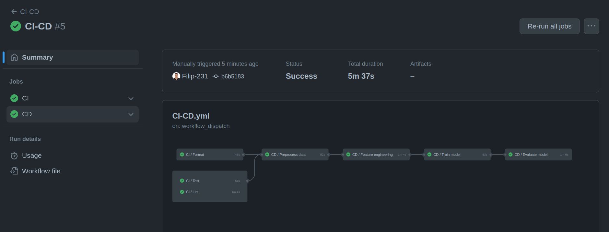

# PN-ML-Challenge
The model parameters used in pipeline can be adjusted by changing **.env** file.

| **Variable** | **Description**                 | **Example Value** |
|--------------|---------------------------------|-------------------|
| TEST_SIZE    | How big the test size should be | 0.3               |
| MAX_R2       | Max allowed R^2                 | 0.03              |

In case model will exceed max allowed R^2 script: *classifier/stages/evaluate_model.py* will log a warning.

## Features
After installing virtual environment `make install`  
activate: `. .venv/bin/activate` and `make help` to see help message.
```
Please use make target where target is one of:
all                 commit and push all changes
brew-allure         install allure with brew long
bump                (PART= ) bump the release version - deduced automatically from commit messages unless PART is provided
changelog           (UNRELEASED= current version) update the changelog incrementally.
check-commit        check the commit message is valid
clean               clean up temp and trash files
commit              make interactive conventional commit
docs                render documentation
format              format code
get-version         output the current version
help                display this help message
install             install the requirements
lint                run static code checkers
pre-install         install pre-requirements
release             create a new github release
tag                 pull tags and tag a new version
test                (ALLURE=True BROWSE=True) run tests
venv                install virtual environment

```
## CI/CD Pipeline
## Continuous Integration and delivery
Complete CI-CD process will be visible in GitHub Actions [page](https://github.com/Filip-231/PN-ML-Challenge/actions) containing:
* **CI** - run on every push to master and on pull requests:
  * **Test**  - run unit tests.
  * **Format** - check if code is formatted.
  * **Lint** - run all static code checkers with prospector.
* **CD** - continuous package delivery:
  * **Preprocessing data** - load data from origin and perform basic operations.
  * **Feature engineering** - create features and split dataset.
  * **Train model** - train model with parameters from **.env** and save **classifier/models/** directory.
  * **Evaluate model** - score model and save output to **classifier/scores** directory.
* **CI/CD** - manual trigger, includes CI and CD pipelines connected.

<center>
<div style="width: 100%; height: 40%">



</div>
</center>

## How to create a new version of model?
Pipeline will always use a model with version specified in **VERSION** file.  
In case of making changes to a model update the recent version:
* `make bump` - will bump the version file of a model based on last commit created with commitizen  
* `make changelog UNRELEASED='cat VERSION'` - update changelog with recent commit history  
* `make all` - commit all files to repository

When a new version of a model will be created stages scripts will create new model file:  
*classifier/data/models/finalized_model-v0.1.0.sav*  
and a new score file:    
*classifier/data/scores/model-v0.1.0.txt*  
This value can be used to determine if a new model should be deployed or rollbacked.
